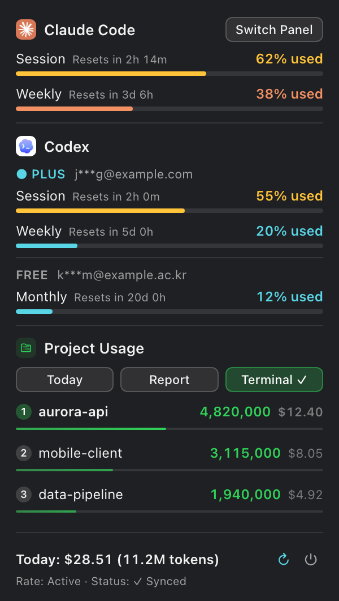

<p align="center">
  
</p>

# usage — 멀티 계정 fork

### Claude Code와 Codex의 사용 한도를 보여주는 macOS 메뉴 막대 앱입니다. OpenCodex로 Codex 로그인을 여러 개 묶어 쓰면 계정별 한도도 따로 보여줍니다.

[English](../README.md) · 한국어

<p align="center">
  
</p>

> lollapalooza의 [aqua5230/usage](https://github.com/aqua5230/usage)를 개인적으로 fork한 버전입니다. 앱에 대한 공로는 모두 원본 프로젝트에 있으며, 전체 기능은 원본 README를 참고하세요. 이 fork는 아래 변경만 더했습니다.

## 이 fork에서 바꾼 점

- **Codex 여러 계정:** OpenCodex(`ocx`)로 Codex 로그인을 여러 개 묶어 쓰면, Codex 카드에 계정마다 별명, 가려진 이메일, 그 계정의 5시간·주간·월간 한도가 따로 표시됩니다.
- **compact 기본 패널:** 폭 300pt, macOS 시스템 폰트와 텍스트 스타일, 한도마다 한 줄, 떠 있는 카드 대신 얇은 구분선, 아이콘으로 된 새로고침·종료 버튼.
- **짧은 합계 표시:** 오늘·어제 토큰 합계를 `11,150,000` 대신 `11.2M`으로 표시합니다.
- **HTML 리포트도 시스템 폰트**로 표시합니다.
- **번들 없이 실행 가능:** `uv run python main.py`로 실행해도 시작하자마자 죽지 않습니다. 앱 번들 밖에서는 알림만 꺼집니다.

## 소스에서 실행

필요한 것: macOS와 [uv](https://docs.astral.sh/uv/)(Python 3.13을 알아서 설치합니다). conda의 Python으로는 빌드하지 마세요. conda가 가진 `libffi` / `libsqlite3` 때문에 `.app`이 실행하자마자 종료됩니다.

```bash
uv sync
uv run python main.py            # 메뉴 막대에서 실행
uv run python main.py --mock     # 가짜 데이터로 UI 확인
./scripts/build_app.sh           # dist/usage.app 빌드
cp -R dist/usage.app /Applications/
```

새로고침 간격은 기본 60초입니다(`--interval N`, 최소 30초).

## Codex 여러 계정

1. OpenCodex pool에 계정을 추가합니다(`ocx account login openai`). `ocx`가 계정별 한도를 한 번 가져오면 Codex 카드가 계정별 표시로 바뀝니다.
2. 계정 이름은 OpenCodex의 별명을 그대로 씁니다. 바꾸려면 `ocx account alias openai <account-id> <이름>`을 실행하세요.
3. `●`는 지금 요청을 처리하는 계정입니다. `⚠ 약 N분 전`은 OpenCodex가 그 계정의 한도를 한동안 갱신하지 않았다는 뜻입니다. 초기화 시각이 이미 지난 한도는 옛 %를 보여주지 않고 `--`로 표시합니다.

OpenCodex가 없거나 아직 한도를 저장하지 않았으면 원본처럼 Codex 자체 세션 로그에서 읽은 계정 하나만 보여줍니다. 계정별 표시는 기본 테마에만 있고, 나머지 13개 테마는 원본과 같습니다.

## 데이터 출처와 개인정보

- Claude Code와 Codex 사용량은 로컬 파일에서 읽습니다. 읽을 때 Anthropic이나 OpenAI의 LLM API를 호출하지 않고 토큰도 쓰지 않습니다.
- Codex 계정별 한도는 OpenCodex의 로컬 캐시 `~/.opencodex/codex-quota-cache.json`에서 읽습니다. 계정 이름은 `ocx account list openai --json`에서 가져오며, 이 출력은 OpenCodex가 이미 가려서 줍니다. `usage`는 OAuth 토큰이 든 `codex-accounts.json`을 열지 않고, 서버에 다시 조회하는 `ocx account refresh`도 실행하지 않습니다.
- 그 밖의 네트워크 사용은 원본과 같습니다. 쓰시는 경우 Antigravity 한도 조회, Claude·Codex 공개 상태 페이지, 공개 모델 가격표, 업데이트 확인입니다. 업데이트 확인은 원본의 릴리스를 보고 브라우저 페이지를 여는 것뿐이니, 알림이 싫으면 메뉴에서 끄세요.

## 그 밖의 기능

상태 줄 hook, HTML 리포트, Antigravity·Grok 카드, 테마, Windows 트레이는 원본과 똑같이 동작합니다. [원본 README](https://github.com/aqua5230/usage#readme)와 [개발 문서](DEVELOPMENT.md)를 참고하세요.

## 라이선스

AGPL-3.0-only([LICENSE](../LICENSE) 참고). Copyright © 2026 lollapalooza. 이 fork의 수정 사항도 같은 라이선스로 공개합니다.
